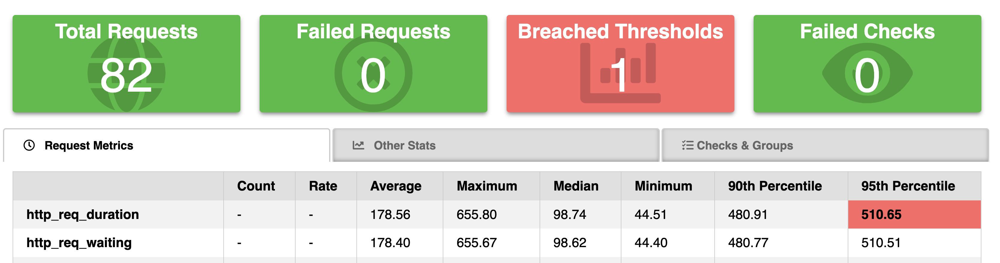

Performance & Load Testing your web services is crucial with APIs becoming more prevalent in usage and required through testing for handling adhoc and busrt loads thoughout the product lifecycle. [K6.io](https://k6.io) is one such tool from well known opensource team graphna labs that enables basic to advance testing sceraios for the developers to test their API's and identify any potential blockages across the service by writing tests in their well known scripting language 'javascript'. This blog article guides you to quickly setup and run the load test in literaly in 5 minutes. YES in 5, can't beleive jump write in

**Features :**

- available as opensource and also SaaS 
- Script tests in Javascript
- Supports 3rd party integrations and extensions
- quick to setup and use

Lets Begin...  <!--truncate-->

1. Install k6
- for mac os with homebrew package manager 
    ```
    brew install k6
    ```

- for linux or debian follow these steps
    ```
    sudo gpg --no-default-keyring --keyring /usr/share/keyrings/k6-archive-keyring.gpg --keyserver hkp://keyserver.ubuntu.com:80 --recv-keys C5AD17C747E3415A3642D57D77C6C491D6AC1D69
    echo "deb [signed-by=/usr/share/keyrings/k6-archive-keyring.gpg] https://dl.k6.io/deb stable main" | sudo tee /etc/apt/sources.list.d/k6.list
    sudo apt-get update
    sudo apt-get install k6
    ```
 - refer k6 documentation for additional options [k6](https://k6.io/docs/get-started/installation/)

 2. Get started with test scripts
 To perform testing on your web application & apis; create new script file for example ***script.js*** and use below sample code  


 ```
    import http from 'k6/http';
    import { sleep } from 'k6';

    export default function () {
    http.get('https://test.k6.io');
    sleep(1);
    }

 ```

 **If you are feeling to do more use below script**

 ```
import {check} from 'k6';
import http from 'k6/http';

const URL = 'https://dummyjson.com/products/1'
// const SEARCH_URL = 'https://dummyjson.com/products/search?q=phone'


var params = {
    Headers: {
        'Content-Type': 'application/json',
        // 'Authorization':'Bearer your key or bearer tokens for the api endpoint'
    },
};

// Simple Get request for 5 concuerrent in 3 s

export let options = {
    vus: 5,
    duration: '30s'
}


export default function () {
    let res = http.get(URL, params);
    // console.log(res)
    check(res, {
        'is status 200': (r) => r.status ===200
    });
}

 ```

3. Run the tests - use the command ``` k6 run script.js``` where script.js is the file name in step 2 above. script file can be named anything, as a best practice name it base don on waht script is expected to do

4. By default it uses 1 virtual user, for running multiple users or simultaneous users use ``` k6 run --vus 5 --duration 30s script.js``` this refers to 5 virtual users for the duration of 30 seconds. Add or change numbers based on what you are trying to acheive. Also can be added to the script under options object. Additional options are available, refer to [K6 documentation](https://k6.io/docs/get-started/running-k6/)

4. Results are displayed upon compeletion with required metrices for users broadly classifed into 2
    - As summary statistics, in an end-of-test summary report.
    - In granular details, with measurements for every data point across test (and timestamps)
5. Sample Result for 5 VUS and 30s Duration from k6/script_get.js in github repository mentioned below
    ```
    k6 run script_get.js 

            /\      |‾‾| /‾‾/   /‾‾/   
        /\  /  \     |  |/  /   /  /    
        /  \/    \    |     (   /   ‾‾\  
    /          \   |  |\  \ |  (‾)  | 
    / __________ \  |__| \__\ \_____/ .io

    execution: local
        script: script_get.js
        output: -

    scenarios: (100.00%) 1 scenario, 5 max VUs, 1m0s max duration (incl. graceful stop):
            * default: 5 looping VUs for 30s (gracefulStop: 30s)


        ✓ is status 200

        checks.........................: 100.00% ✓ 2732      ✗ 0   
        data_received..................: 1.8 MB  59 kB/s
        data_sent......................: 101 kB  3.4 kB/s
        http_req_blocked...............: avg=435.17µs min=0s      med=1µs     max=243.67ms p(90)=1µs     p(95)=2µs     
        http_req_connecting............: avg=49.01µs  min=0s      med=0s      max=28.26ms  p(90)=0s      p(95)=0s      
        http_req_duration..............: avg=54.23ms  min=31.52ms med=50.78ms max=720.83ms p(90)=64.94ms p(95)=73.46ms 
        { expected_response:true }...: avg=54.23ms  min=31.52ms med=50.78ms max=720.83ms p(90)=64.94ms p(95)=73.46ms 
        http_req_failed................: 0.00%   ✓ 0         ✗ 2732
        http_req_receiving.............: avg=918.92µs min=25µs    med=103µs   max=77.08ms  p(90)=1.98ms  p(95)=3ms     
        http_req_sending...............: avg=126.7µs  min=21µs    med=96µs    max=13.78ms  p(90)=205µs   p(95)=279.89µs
        http_req_tls_handshaking.......: avg=170.46µs min=0s      med=0s      max=100.87ms p(90)=0s      p(95)=0s      
        http_req_waiting...............: avg=53.19ms  min=31.31ms med=49.86ms max=720.59ms p(90)=64.07ms p(95)=71.94ms 
        http_reqs......................: 2732    90.903468/s
        iteration_duration.............: avg=54.89ms  min=31.67ms med=50.99ms max=721.07ms p(90)=65.28ms p(95)=74.14ms 
        iterations.....................: 2732    90.903468/s
        vus............................: 5       min=5       max=5 
        vus_max........................: 5       min=5       max=5 


    running (0m30.1s), 0/5 VUs, 2732 complete and 0 interrupted iterations
    default ✓ [======================================] 5 VUs  30s
    ```

As you can see with 10 to 20 lines of code we were able to run 2700++ requests with 5 virtual users with max duration of 30s. Go ahead and try it out yourself.

There are some samples for http methods like get, put, post and one may refer to code in k6 folder of the [github repository](https://github.com/mrpavan/performance-testing). I have used [dummyjson.com](https://dummyjson.com/) for api requests and response assertions and request url's may be updated to suit your needs before executing the scripts. Feel free to modify and use it as needed.

