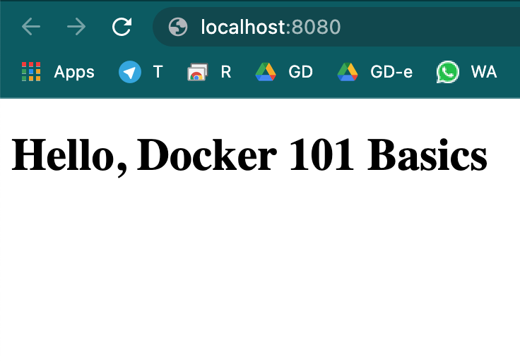

Docker is one of the most loved tool by developers and operations team and used extensively in service deployments. Docker helps to package applications in to portable container images that can run on any enviornment be it on-premise or developer desktop or production enviornments. Docker takes away repetitive, mundane configuration tasks and is used throughout the development lifecycle for fast, easy and portable application development – desktop and cloud. Docker’s comprehensive end to end platform includes UIs, CLIs, APIs and security that are engineered to work together across the entire application delivery lifecycle. Visit [docker](https://docker.com) website for more details 

Lets check how to install docker and start utilising containers for different workloads. 

By the end of this tutorial, you will have learned 
1. How to install docker
2. Docker images and run container
2. Check running containers
4. Dockerfile 5 Easy Steps - Building your own images and running containers
 

Let's get started!

Docker provides 2 sets of installers 
- Docker Desktop for use with desktop computers running macos, windows and linux. Installation is as simple as downloading correct version for your operating system and following though steps if you are lazy to read click next. [Click Here for instructions](https://docs.docker.com/get-docker/)
- Docker Engine - an ***open source containerization technology*** for building and containerizing your applications.primarly used for deploying on application hosted enviornments as a client server application with long running server process **dockerd** and provides client CLI as **docker**.  

We will go though ubuntu but these steps will work in any system running debain. On the docker official site once can access instructions for other operating systems, feel free to [check them out at our leasure time](https://docs.docker.com/engine/install/). 

### 1. Installation 

There are multiple methods for successfully installing docker engine, one such method is handy convience script 

You can run the script with the --dry-run option to learn what steps the script will run when invoked:

```
curl -fsSL https://get.docker.com -o get-docker.sh
sudo sh ./get-docker.sh --dry-run
```

:::tip My tip

Avoid using in production deployments and go though respective package manager route. Well nothing wrong in using it with caution, read though dry-run otuput an dmake sure it is not doing any unwanted things. 

:::

To proceed with installation and install latest stable release

```
curl -fsSL https://get.docker.com -o get-docker.sh
sudo sh get-docker.sh
Executing docker install script, commit: 7cae5f8b0decc17d6571f9f52eb840fbc13b2737
<...>
```


### 2. Downloading docker images

Visit [docker hub](https://hub.docker.com/) and explore the images, and look out for command on the top left for an image to download it to your machine. Docker images are tagged with versions or variations seperated by : i.e.,  image:version-tag and if only image name is used it will default to :latest

For downloading new mysql image 

```
docker pull mysql
```

or

``` 
docker pull mysql:8.0

```

Starting a MySQL instance:

```
  docker run --name some-friendly-name -e MYSQL_ROOT_PASSWORD=my-secret-pw -d mysql:tag
```
-d tells run the server as backgroud process, if you want to run in interactive mode remove it

### 3. Check running containers

Run the command 
``` docker ps ``` or ```docker ps -a``` for viewing running containers. -a shows all containers that are  with status running as well as exited or other modes.

### 4. Dockerfile

Docker file is a document that holds set of instructions & commands a user performs to assemble an image. It starts from base image that is refering to either public repository - dockerhub or private repositories where container images are stored. We are going to build a simple docker image that hosts an static html file using nginx server. In future topics we will cover more advanced dockerfile commands including multi-stage build and how to dockerise your existing applications. 

You can use any static html file you have and skip step 1.
Step 1. Create a new folder and add a file called index.html and paste this code

```
<!DOCTYPE html>
<html lang="en">
<head>
    <meta charset="UTF-8">
    <meta http-equiv="X-UA-Compatible" content="IE=edge">
    <meta name="viewport" content="width=device-width, initial-scale=1.0">
    <title>Docker101</title>
</head>
<body>
    <h1>Hello, Docker 101 Basics</h1>
</body>
</html>
```

Step 2. Create a file named ***Dockerfile*** in the same folder and add below commands

```
FROM nginx:alpine
COPY . /usr/share/nginx/html
```

Make sure to name the file in exact sentence case ***Dockerfile*** . In future we will check on how to build container images using custom file names.
Step 3. Build Image

```
docker build -t my-server:latest .
```

This command says build the container image with name tag as myserver:latest (:latest can be omitted or can be set to v1, v2 or anything as one needs) using . (this folder as context - location of Dockerfile)

Upon completion, check for image availability ``` docker image ls``` or ```docker images```

Step 4. Run the Image
```
docker run -d -p 80:80 my-server:latest
```
If port 80 is occupied on yuor machine, pls change to other ports like 8080
```
docker run -d -p 8080:80 my-server:latest
```

Step 5. Check the webpage by visiting localhost or localhost:8080

You should see the page similar to below


Thats it! in 5 steps you were able to create your own custom docker image, run it and access it. Keep visiting for more such informative articles on docker !!!